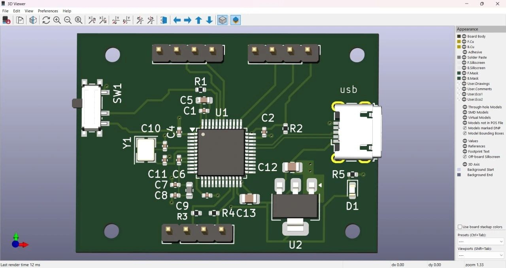

# Stm32 PCB Design

This repository contains the complete KiCad project files, Gerber files, and documentation for a two-layer PCB designed around the STM32F103C8T6 microcontroller.

---

## Project Overview

- **Microcontroller:** STM32F103C8T6
- **Software Used:** KiCad (version XX.X)
- **Layers:** 2-layer PCB (Top and Bottom)
- **USB Connector:** Micro USB for power and communication
- **Features:**
  - Crystal oscillator circuit for clock
  - Reset switch and reset circuitry
  - Voltage regulator (AMS1117 3.3V)
  - Decoupling capacitors for stable operation
  - USB interface pins for programming and communication
  - Mounting holes for secure fitting

---

## Repository Contents

- `KiCad_Files/` — Schematic and PCB design files for KiCad
- `Gerber_Files/` — Exported Gerber files ready for manufacturing

- `3D_Models/` — 3D renderings and images of the PCB layout
- `Documentation/` — Additional notes, and references

---

## How to Use

1. Open the schematic (`schematic.sch`) and PCB layout (`pcb.kicad_pcb`) files in KiCad.
2. Review the design, and if needed, modify according to your project requirements.
3. Use the Gerber files in the `Gerber_Files` folder to send to a PCB manufacturer.
4. Use the 3D models for visual verification and mechanical fitting.

---

## Design Considerations

- The power supply circuit uses AMS1117 to convert USB 5V to 3.3V needed by the STM32.
- USB signals are routed carefully to minimize noise.
- Decoupling capacitors are placed near the MCU pins for stable voltage.
- The board outline and mounting holes are designed for standard enclosures.

---

## Contact

For questions or collaboration, please reach out at fariaanowara82@gmail.com

---

## Screenshots / Images

---

*This project is ideal for embedded system developers who want a ready-to-use STM32 PCB design with USB interface and basic power management.*

